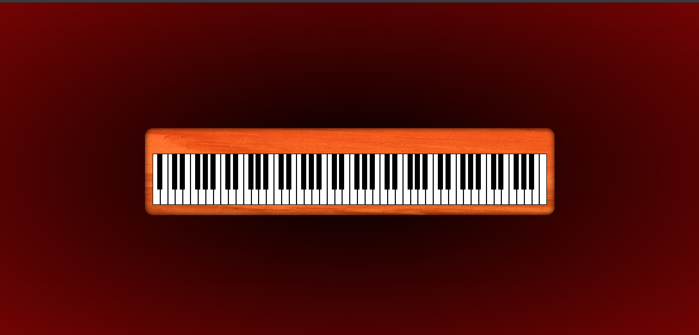

## A beautifully designed, fully responsive, and simple piano app featuring all 88 keys

(88 keys = 52 white keys + 36 black keys)

Created Using HTML, CSS, JS

### 👉 **[🎹 Live Demo](https://hassnahajizadeh-piano-project.netlify.app)**

---

### Screenshot

### 🎵 Audio Source

The piano sounds in this app are sourced from the [3D Piano Player](https://github.com/reality3d/3d-piano-player) repository.

### 🎹 Why computer Keyboard Keys Are Not Used

This project does not include support for playing piano notes using computer keyboard keys because standard keyboards do not have enough keys to match a full piano layout. Instead, clicking on the on-screen keys is required to play sounds.
